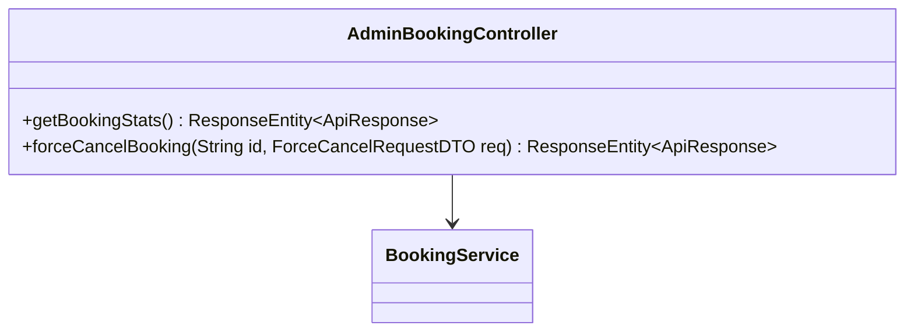
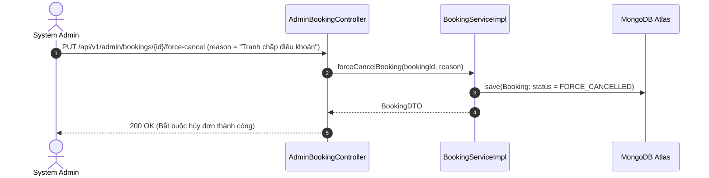

# UC-11.6 — Thống Kê & Bắt Buộc Hủy Admin (Admin Booking Controls)

## 📋 1. Bảng Mô Tả Nghiệp Vụ (Business Description Table)

| Mục | Chi Tiết Nghiệp Vụ |
|---|---|
| **Mã Use Case** | `UC-11.6` |
| **Tên Tính Năng** | Thống kê đơn đặt MC & Bắt buộc hủy đơn Admin |
| **Actor Chính** | Admin |
| **Mục Tiêu** | Xem số liệu tổng đơn, doanh thu và bắt buộc hủy đơn (`FORCE_CANCELLED`) khi có tranh chấp |
| **API Endpoint** | `GET /api/v1/admin/bookings/stats`, `PUT /api/v1/admin/bookings/{id}/force-cancel` |
| **Tiền Điều Kiện** | Quyền `ROLE_ADMIN` |
| **Hậu Điều Kiện** | Chuyển `status = FORCE_CANCELLED` và kích hoạt lệnh hoàn tiền |
| **Quy Tắc Nghiệp Vụ** | Xử lý tranh chấp giữa Client và MC Talent |
| **Các Mã Lỗi Có Thể Gặp** | `BOOKING_NOT_FOUND` (404), `FORBIDDEN` (403) |

---

## 📐 2. Class Diagram

---

## 🔄 3. Sequence Diagram

---

## 🧪 4. Testing & Verification Report

- **Test Suite Class:** `com.mchub.controllers.AdminBookingControllerTest`
- **Method Kiểm Thử:** `forceCancelBooking_adminRole_cancelsBooking()`
- **Assertions:** Status đơn hàng thành `FORCE_CANCELLED`.
