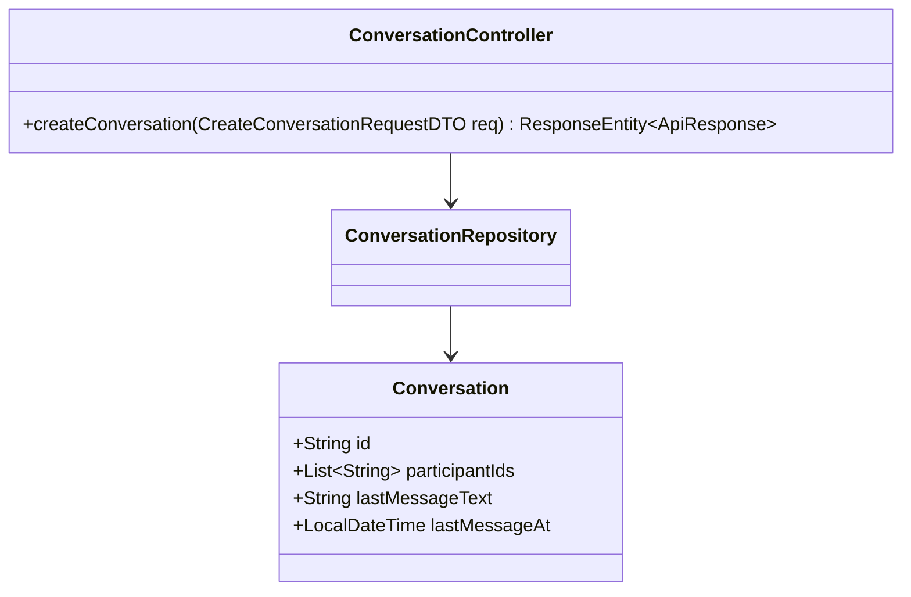
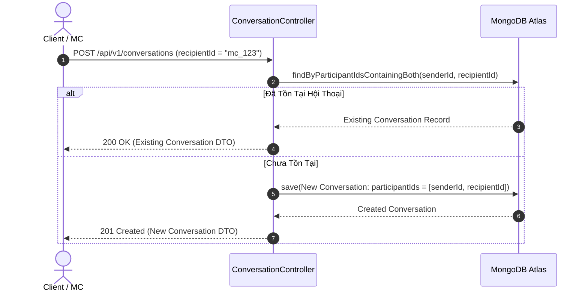

# UC-12.1 — Tạo Cuộc Trò Chuyện Mới (Create Conversation)

## 📋 1. Bảng Mô Tả Nghiệp Vụ (Business Description Table)

| Mục | Chi Tiết Nghiệp Vụ |
|---|---|
| **Mã Use Case** | `UC-12.1` |
| **Tên Tính Năng** | Tạo cuộc hội thoại tin nhắn mới |
| **Actor Chính** | Authenticated User (Client / MC) |
| **Mục Tiêu** | Mở kênh nhắn tin trực tiếp với một người dùng khác |
| **API Endpoint** | `POST /api/v1/conversations` |
| **Tiền Điều Kiện** | User và Recipient tồn tại trong hệ thống |
| **Hậu Điều Kiện** | Trả về `Conversation` vừa tạo hoặc tái sử dụng hội thoại cũ nếu đã có |
| **Quy Tắc Nghiệp Vụ** | Mỗi cặp User (Sender, Recipient) chỉ có duy nhất 1 cuộc trò chuyện |
| **Các Mã Lỗi Có Thể Gặp** | `USER_NOT_FOUND` (404), `CANNOT_CHAT_SELF` (400) |

---

## 📐 2. Class Diagram

---

## 🔄 3. Sequence Diagram

---

## 🧪 4. Testing & Verification Report

- **Test Suite Class:** `com.mchub.controllers.ConversationControllerTest`
- **Method Kiểm Thử:** `createConversation_existingParticipants_returnsExistingConversation()`
- **Assertions:** Trả về đối tượng `Conversation` với đúng 2 participant IDs.
