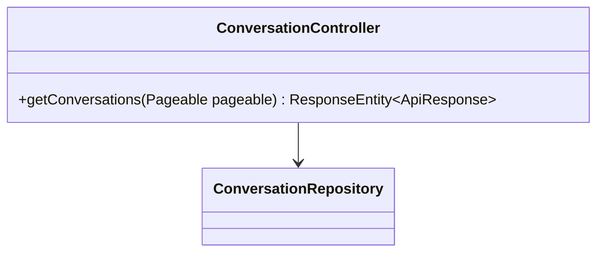
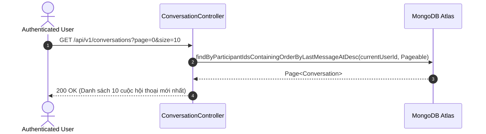

# UC-12.2 — Danh Sách Cuộc Trò Chuyện Gần Đây (Get Conversation List)

## 📋 1. Bảng Mô Tả Nghiệp Vụ (Business Description Table)

| Mục | Chi Tiết Nghiệp Vụ |
|---|---|
| **Mã Use Case** | `UC-12.2` |
| **Tên Tính Năng** | Tra cứu danh sách các cuộc trò chuyện gần đây |
| **Actor Chính** | Authenticated User |
| **Mục Tiêu** | Tải danh sách phân trang các cuộc hội thoại cá nhân kèm nội dung tin nhắn mới nhất |
| **API Endpoint** | `GET /api/v1/conversations` |
| **Tiền Điều Kiện** | User đã đăng nhập |
| **Hậu Điều Kiện** | Trả về `Page<Conversation>` |
| **Quy Tắc Nghiệp Vụ** | Sắp xếp giảm dần theo thời gian tin nhắn cuối (`lastMessageAt DESC`) |
| **Các Mã Lỗi Có Thể Gặp** | `UNAUTHORIZED` (401) |

---

## 📐 2. Class Diagram

---

## 🔄 3. Sequence Diagram

---

## 🧪 4. Testing & Verification Report

- **Test Suite Class:** `com.mchub.controllers.ConversationControllerTest`
- **Method Kiểm Thử:** `getConversations_returnsUserConversations()`
- **Assertions:** Danh sách trả về chỉ chứa các hội thoại mà `currentUserId` tham gia.
