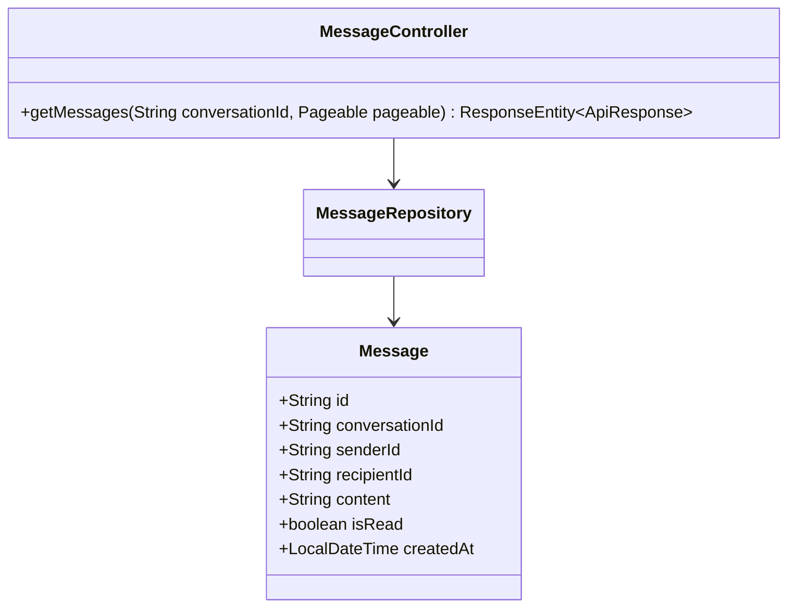
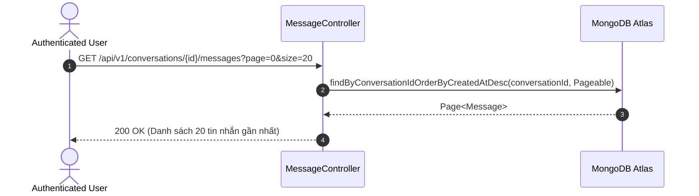

# UC-12.3 — Lịch Sử Tin Nhắn Phân Trang (Get Message History)

##  1. Bảng Mô Tả Nghiệp Vụ (Business Description Table)

| Mục | Chi Tiết Nghiệp Vụ |
|---|---|
| **Mã Use Case** | `UC-12.3` |
| **Tên Tính Năng** | Xem lịch sử tin nhắn trong một cuộc hội thoại |
| **Actor Chính** | Authenticated User |
| **Mục Tiêu** | Tải tin nhắn cũ phân trang trong khung chat |
| **API Endpoint** | `GET /api/v1/conversations/{id}/messages` |
| **Tiền Điều Kiện** | User thuộc danh sách `participantIds` của hội thoại này |
| **Hậu Điều Kiện** | Trả về `Page<Message>` |
| **Quy Tắc Nghiệp Vụ** | Sắp xếp theo ngày tạo mới nhất (`createdAt DESC`) |
| **Các Mã Lỗi Có Thể Gặp** | `FORBIDDEN_CONVERSATION` (403), `CONVERSATION_NOT_FOUND` (404) |

---

##  2. Class Diagram

---

##  3. Sequence Diagram

---

##  4. Testing & Verification Report

- **Test Suite Class:** `com.mchub.controllers.MessageControllerTest`
- **Method Kiểm Thử:** `getMessages_returnsConversationMessages()`
- **Assertions:** Trả về danh sách tin nhắn khớp đúng `conversationId`.
