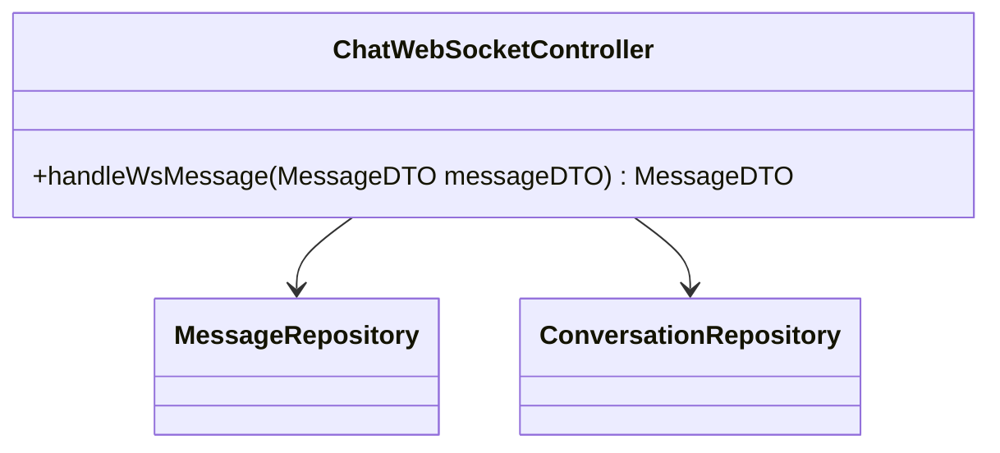
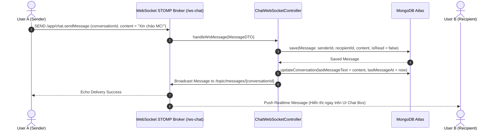

# UC-12.4 — Gửi Tin Nhắn Realtime Qua WebSocket STOMP (Send WS Message)

## 📋 1. Bảng Mô Tả Nghiệp Vụ (Business Description Table)

| Mục | Chi Tiết Nghiệp Vụ |
|---|---|
| **Mã Use Case** | `UC-12.4` |
| **Tên Tính Năng** | Gửi tin nhắn tức thì (Realtime) qua WebSocket STOMP |
| **Actor Chính** | Authenticated User (Sender) |
| **Mục Tiêu** | Đẩy tin nhắn mới tới người nhận qua socket và lưu vào Database |
| **API Endpoint** | `WS /ws-chat` (Topic destination: `/app/chat.sendMessage`) |
| **Tiền Điều Kiện** | Kết nối WebSocket STOMP thành công |
| **Hậu Điều Kiện** | Lưu `Message` (`isRead=false`), update `Conversation.lastMessageText` và broadcast tới `/topic/messages/{conversationId}` |
| **Quy Tắc Nghiệp Vụ** | Phát tin nhắn realtime ngay lập tức mà người nhận không cần reload |
| **Các Mã Lỗi Có Thể Gặp** | `WEBSOCKET_DISCONNECTED` (500) |

---

## 📐 2. Class Diagram

---

## 🔄 3. Sequence Diagram

---

## 🧪 4. Testing & Verification Report

- **Test Suite Class:** `com.mchub.controllers.MessageControllerTest`
- **Method Kiểm Thử:** `sendMessage_validPayload_savesAndUpdatesLastMessage()`
- **Assertions:** Tin nhắn được lưu vào DB và `lastMessageText` được cập nhật.
