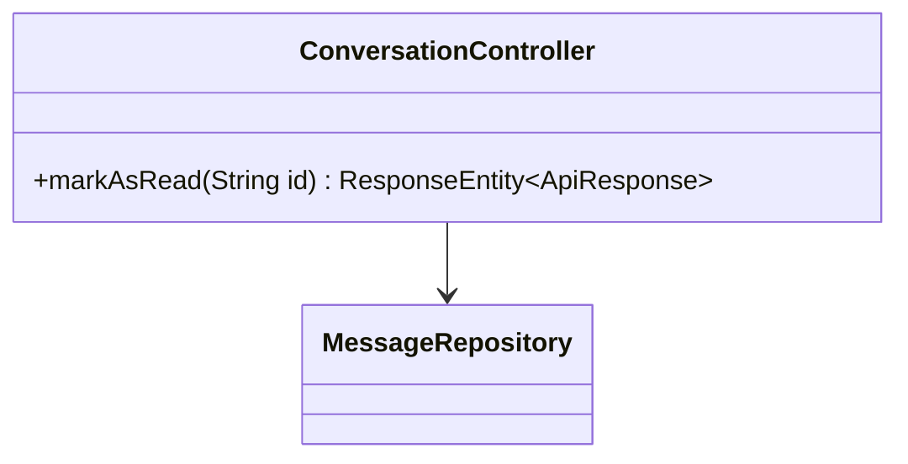
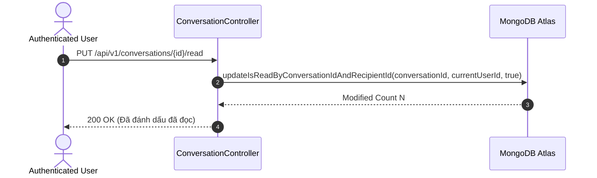

# UC-12.5 — Đánh Dấu Đã Đọc Tin Nhắn (Mark Conversation Read)

## 📋 1. Bảng Mô Tả Nghiệp Vụ (Business Description Table)

| Mục | Chi Tiết Nghiệp Vụ |
|---|---|
| **Mã Use Case** | `UC-12.5` |
| **Tên Tính Năng** | Đánh dấu tất cả tin nhắn trong cuộc trò chuyện thành đã đọc |
| **Actor Chính** | Authenticated User |
| **Mục Tiêu** | Chuyển `isRead = true` cho các tin nhắn được gửi tới user trong cuộc hội thoại đó |
| **API Endpoint** | `PUT /api/v1/conversations/{id}/read` |
| **Tiền Điều Kiện** | User tham gia cuộc hội thoại |
| **Hậu Điều Kiện** | Update tất cả tin nhắn chưa đọc trong hội thoại thành `isRead=true` |
| **Quy Tắc Nghiệp Vụ** | Giúp giảm số lượng tin nhắn chưa đọc trên thanh điều hướng |
| **Các Mã Lỗi Có Thể Gặp** | `CONVERSATION_NOT_FOUND` (404) |

---

## 📐 2. Class Diagram

---

## 🔄 3. Sequence Diagram

---

## 🧪 4. Testing & Verification Report

- **Test Suite Class:** `com.mchub.controllers.ConversationControllerTest`
- **Method Kiểm Thử:** `markAsRead_updatesUnreadMessages()`
- **Assertions:** Tất cả tin nhắn gửi cho user trong hội thoại chuyển thành `isRead = true`.
