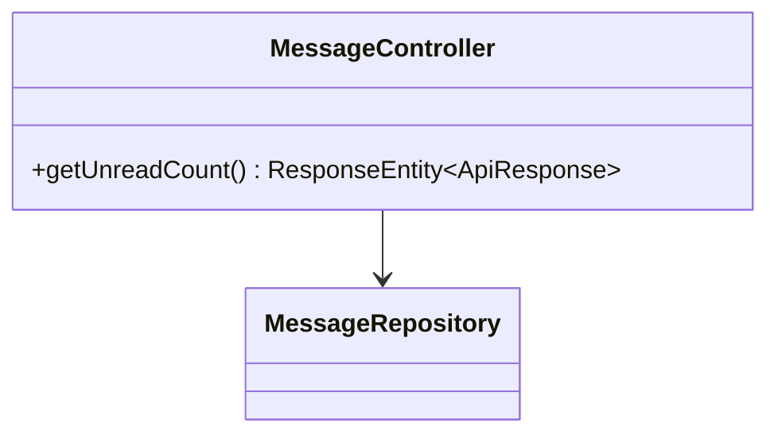
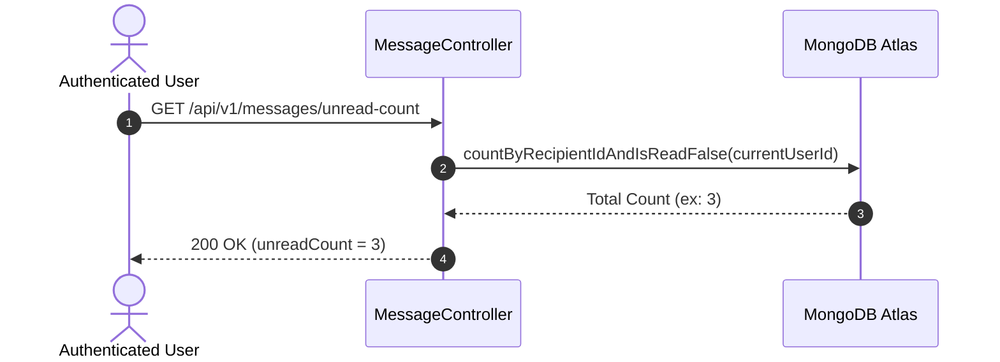

# UC-12.6 — Tổng Số Tin Nhắn Chưa Đọc (Get Unread Message Count)

##  1. Bảng Mô Tả Nghiệp Vụ (Business Description Table)

| Mục | Chi Tiết Nghiệp Vụ |
|---|---|
| **Mã Use Case** | `UC-12.6` |
| **Tên Tính Năng** | Đếm tổng số tin nhắn chưa đọc của người dùng |
| **Actor Chính** | Authenticated User |
| **Mục Tiêu** | Trả về tổng số lượng tin nhắn chưa đọc trên toàn bộ các cuộc hội thoại để hiển thị Badge đỏ |
| **API Endpoint** | `GET /api/v1/messages/unread-count` |
| **Tiền Điều Kiện** | User đã đăng nhập |
| **Hậu Điều Kiện** | Trả về số lượng `unreadCount` |
| **Quy Tắc Nghiệp Vụ** | Đếm các tin nhắn có `recipientId = currentUserId` và `isRead = false` |
| **Các Mã Lỗi Có Thể Gặp** | `UNAUTHORIZED` (401) |

---

##  2. Class Diagram

---

##  3. Sequence Diagram

---

##  4. Testing & Verification Report

- **Test Suite Class:** `com.mchub.controllers.MessageControllerTest`
- **Method Kiểm Thử:** `getUnreadCount_returnsCorrectCount()`
- **Assertions:** Trả về chính xác số lượng tin nhắn chưa đọc.
