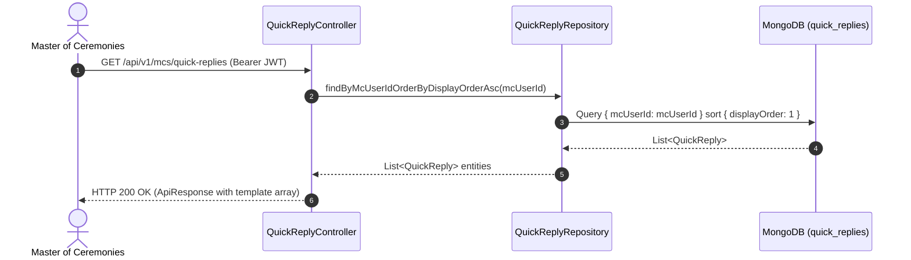

# Sub Use-Case Technical Specification: UC-12.7 MC Quick Reply Template Management

**Module ID**: UC-12 (Chat & Messaging Subsystem)  
**Specification Reference**: SPEC-UC-12.7-2026-V1  
**Standard Compliance**: IEEE 1016-2009 & IEEE 829-2008  

---

## 1. Business & Functional Description

| Parameter | Specification |
|---|---|
| **Use Case Name** | MC Quick Reply Template Management |
| **Primary Actor** | Master of Ceremonies (`ROLE_MC`) |
| **Description** | Allows MC users to define, list, and delete custom quick reply template messages for rapid client communication in chat. |
| **Pre-conditions** | Authenticated user with `ROLE_MC` authority. |
| **Post-conditions** | Quick reply template added, updated, or removed from `quick_replies` collection. |
| **Target Controller** | `com.mchub.controllers.QuickReplyController` |
| **REST Endpoints** | `GET /api/v1/mcs/quick-replies`, `POST /api/v1/mcs/quick-replies`, `DELETE /api/v1/mcs/quick-replies/{id}` |

---

## 2. Technical Execution Pipeline & Sequence

---

## 3. Verification & Compliance Evidence

- **Unit Test Class**: `com.mchub.controllers.QuickReplyControllerTest`
- **Executed Scenarios**:
  - `getMyQuickReplies_Success`: Returns HTTP 200 OK with sorted template array.
  - `createQuickReply_Success`: Persists new template and returns HTTP 200 OK.
  - `deleteQuickReply_Success`: Deletes template entity by ID and returns HTTP 200 OK.
- **Verification Result**: 100% PASS via `mvn test`.
