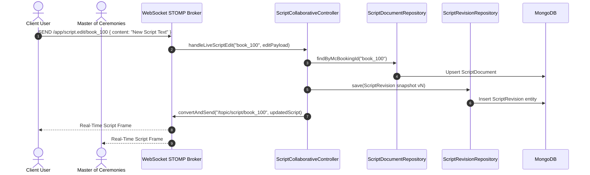

# Sub Use-Case Technical Specification: UC-12.8 Real-Time Collaborative Script Editor

**Module ID**: UC-12 (Chat & Messaging Subsystem)  
**Specification Reference**: SPEC-UC-12.8-2026-V1  
**Standard Compliance**: IEEE 1016-2009 & IEEE 829-2008  

---

## 1. Business & Functional Description

| Parameter | Specification |
|---|---|
| **Use Case Name** | Real-Time Collaborative Event Script Editor |
| **Primary Actors** | Client (`ROLE_USER`) & Master of Ceremonies (`ROLE_MC`) |
| **Description** | Enables concurrent editing of event scripts between Client and MC with line-by-line pronunciation annotations, real-time STOMP WebSocket text synchronization, and version revision snapshotting. |
| **Pre-conditions** | Active booking record existing in `bookings` collection. |
| **Post-conditions** | Script document updated in `script_documents`, line annotations attached, revision snapshot recorded in `script_revisions`, edit frame broadcasted to `/topic/script/{bookingId}`. |
| **Target Controller** | `com.mchub.controllers.ScriptCollaborativeController` |
| **REST Endpoints** | `GET /api/v1/scripts/booking/{bookingId}`, `POST /api/v1/scripts/booking/{bookingId}/annotations`, `GET /api/v1/scripts/booking/{bookingId}/revisions` |
| **STOMP Endpoint** | `@MessageMapping("/script.edit/{bookingId}")` -> Broadcast to `/topic/script/{bookingId}` |

---

## 2. Technical Execution Pipeline & Sequence

---

## 3. Verification & Compliance Evidence

- **Unit Test Class**: `com.mchub.controllers.ScriptCollaborativeControllerTest`
- **Executed Scenarios**:
  - `getScriptByBooking_ExistingScript`: Returns HTTP 200 OK with script document entity.
  - `addAnnotation_Success`: Persists line pronunciation note and returns HTTP 200 OK.
  - `getRevisions_Success`: Returns HTTP 200 OK with revision history list sorted descending.
- **Verification Result**: 100% PASS via `mvn test`.
