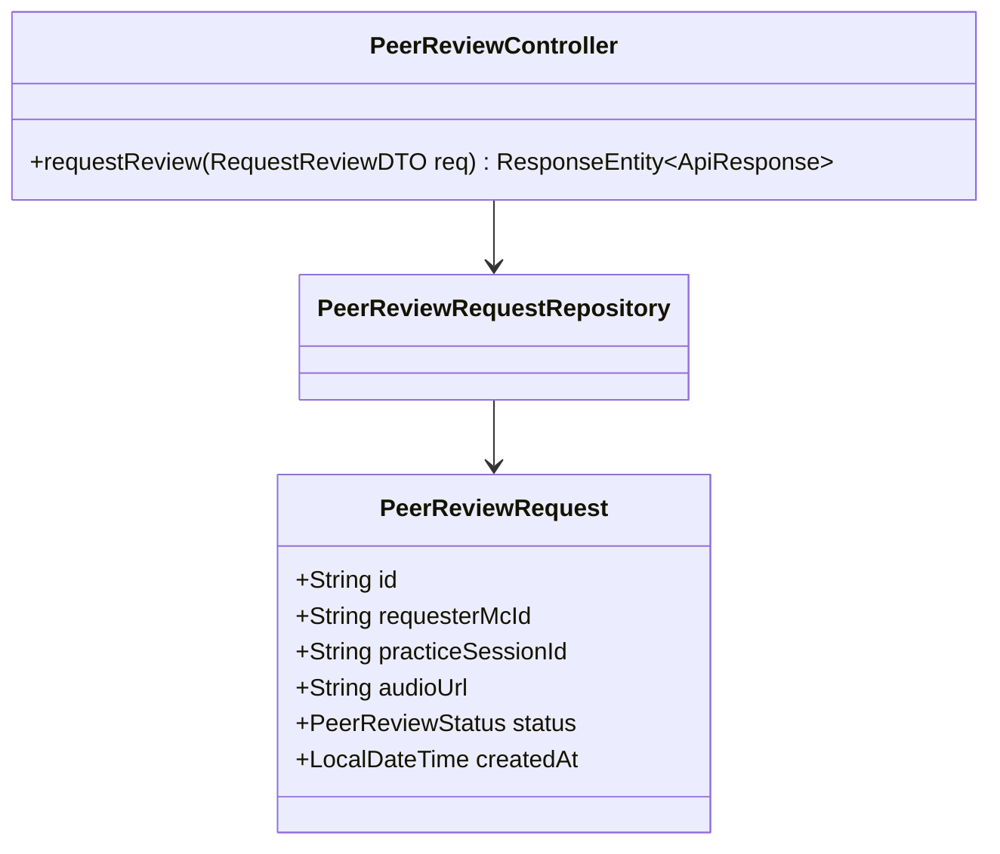
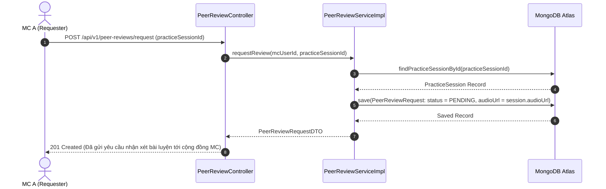

# UC-13.1 — Gửi Yêu Cầu Nhận Xét Đồng Nghiệp (Request Peer Review)

## 📋 1. Bảng Mô Tả Nghiệp Vụ (Business Description Table)

| Mục | Chi Tiết Nghiệp Vụ |
|---|---|
| **Mã Use Case** | `UC-13.1` |
| **Tên Tính Năng** | Gửi yêu cầu nhận xét bài luyện giọng tới cộng đồng MC |
| **Actor Chính** | MC (Requester) |
| **Mục Tiêu** | Đưa bài luyện giọng đã hoàn thành vào hàng chờ nhận xét chuyên môn |
| **API Endpoint** | `POST /api/v1/peer-reviews/request` |
| **Tiền Điều Kiện** | Phiên `PracticeSession` tồn tại và thuộc sở hữu của MC |
| **Hậu Điều Kiện** | Lưu `PeerReviewRequest` ở trạng thái `PENDING` |
| **Quy Tắc Nghiệp Vụ** | Mỗi phiên luyện giọng chỉ gửi yêu cầu review tối đa 1 lần |
| **Các Mã Lỗi Có Thể Gặp** | `SESSION_NOT_FOUND` (404), `DUPLICATE_REVIEW_REQUEST` (400) |

---

## 📐 2. Class Diagram

---

## 🔄 3. Sequence Diagram

---

## 🧪 4. Testing & Verification Report

- **Test Suite Class:** `com.mchub.services.impl.PeerReviewServiceImplTest`
- **Method Kiểm Thử:** `requestReview_success_createsPendingRequest()`
- **Assertions:** Tạo `PeerReviewRequest` với trạng thái `PENDING`.
