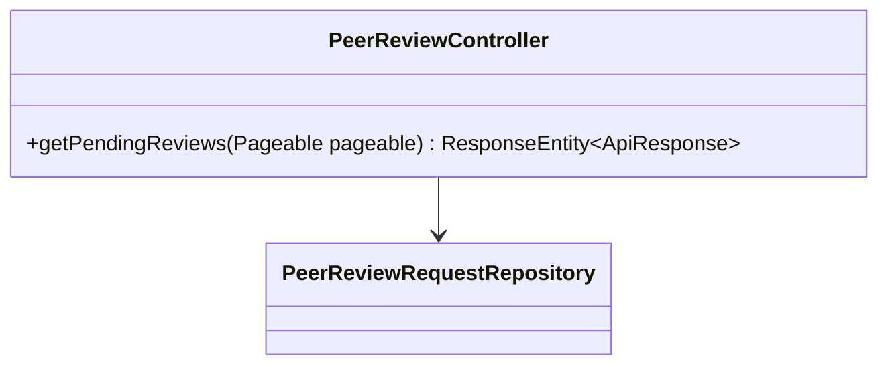
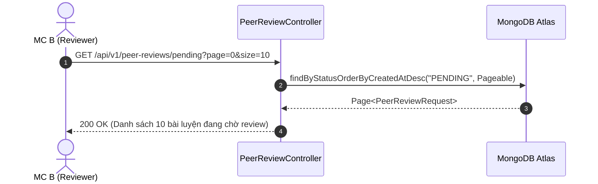

# UC-13.2 — Danh Sách Bài Tập Chờ Review (Get Pending Peer Reviews)

## 📋 1. Bảng Mô Tả Nghiệp Vụ (Business Description Table)

| Mục | Chi Tiết Nghiệp Vụ |
|---|---|
| **Mã Use Case** | `UC-13.2` |
| **Tên Tính Năng** | Xem danh sách các bài luyện giọng từ đồng nghiệp đang chờ nhận xét |
| **Actor Chính** | MC (Reviewer) |
| **Mục Tiêu** | Lấy danh sách phân trang các bài đọc cần nhận xét góp ý |
| **API Endpoint** | `GET /api/v1/peer-reviews/pending` |
| **Tiền Điều Kiện** | User có vai trò MC (`role = MC`) |
| **Hậu Điều Kiện** | Trả về `Page<PeerReviewRequest>` |
| **Quy Tắc Nghiệp Vụ** | Không hiển thị các bài luyện do chính mình gửi |
| **Các Mã Lỗi Có Thể Gặp** | `FORBIDDEN_MC_ONLY` (403) |

---

## 📐 2. Class Diagram

---

## 🔄 3. Sequence Diagram

---

## 🧪 4. Testing & Verification Report

- **Test Suite Class:** `com.mchub.controllers.PeerReviewControllerTest`
- **Method Kiểm Thử:** `getPending_returnsPendingRequests()`
- **Assertions:** Trả về danh sách bài có trạng thái `PENDING`.
