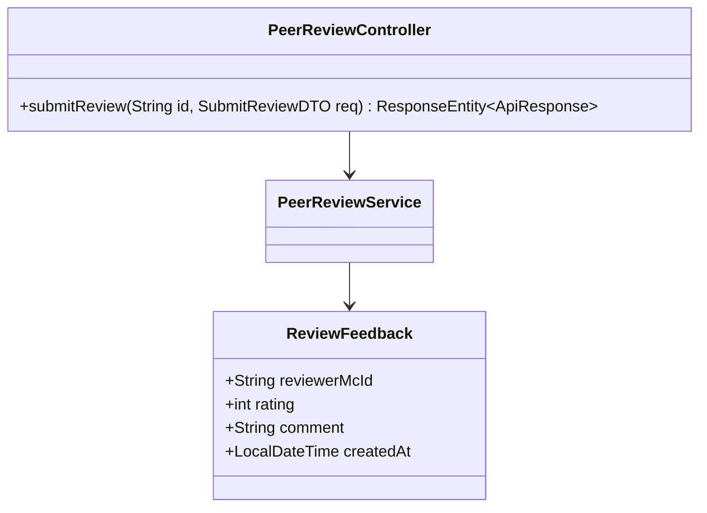
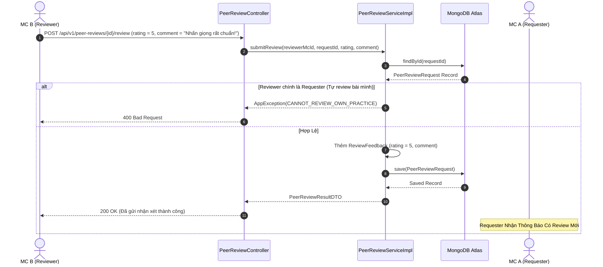

# UC-13.3 — Chấm Điểm & Gửi Feedback Chuyên Môn (Submit Peer Review)

##  1. Bảng Mô Tả Nghiệp Vụ (Business Description Table)

| Mục | Chi Tiết Nghiệp Vụ |
|---|---|
| **Mã Use Case** | `UC-13.3` |
| **Tên Tính Năng** | Chấm điểm sao và gửi lời khuyên chuyên môn cho đồng nghiệp |
| **Actor Chính** | MC (Reviewer) |
| **Mục Tiêu** | Nghe file ghi âm, chọn số sao (1-5) và viết câu góp ý giúp đồng nghiệp nâng cao kỹ năng |
| **API Endpoint** | `POST /api/v1/peer-reviews/{id}/review` |
| **Tiền Điều Kiện** | `requesterMcId != reviewerMcId` (Cấm tự review bài mình) |
| **Hậu Điều Kiện** | Lưu `ReviewFeedback` vào mảng `feedbacks` của yêu cầu review |
| **Quy Tắc Nghiệp Vụ** | Mỗi MC chỉ được gửi 1 feedback/yêu cầu review. Điểm rating từ 1 đến 5 |
| **Các Mã Lỗi Có Thể Gặp** | `CANNOT_REVIEW_OWN_PRACTICE` (400), `ALREADY_REVIEWED` (400) |

---

##  2. Class Diagram

---

##  3. Sequence Diagram

---

##  4. Testing & Verification Report

- **Test Suite Class:** `com.mchub.services.impl.PeerReviewServiceImplTest`
- **Method Kiểm Thử:** `submitReview_cannotReviewOwnPractice_throwsException()`
- **Assertions:** Ngăn chặn thành công MC tự chấm điểm bài cá nhân, lưu đúng feedback khi hợp lệ.
