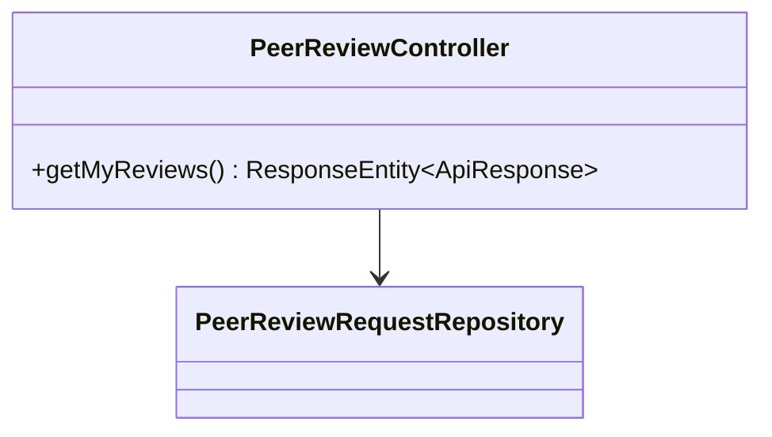
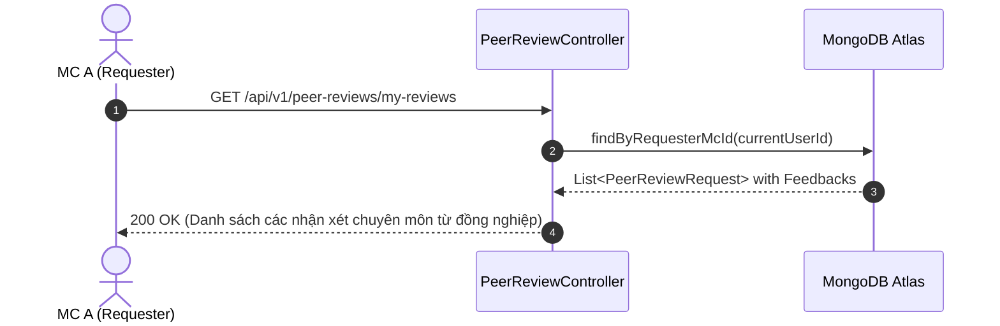

# UC-13.4 — Xem Phản Hồi Đã Nhận (Get Received Peer Reviews)

## 📋 1. Bảng Mô Tả Nghiệp Vụ (Business Description Table)

| Mục | Chi Tiết Nghiệp Vụ |
|---|---|
| **Mã Use Case** | `UC-13.4` |
| **Tên Tính Năng** | Xem danh sách các đánh giá từ đồng nghiệp dành cho bài luyện của mình |
| **Actor Chính** | MC (Requester) |
| **Mục Tiêu** | Đọc ý kiến góp ý, nhận xét chuyên môn và điểm số sao nhận được |
| **API Endpoint** | `GET /api/v1/peer-reviews/my-reviews` |
| **Tiền Điều Kiện** | MC đã đăng nhập |
| **Hậu Điều Kiện** | Trả về `List<PeerReviewRequestDTO>` kèm mảng `feedbacks` |
| **Quy Tắc Nghiệp Vụ** | Sắp xếp theo ngày tạo yêu cầu mới nhất |
| **Các Mã Lỗi Có Thể Gặp** | `UNAUTHORIZED` (401) |

---

## 📐 2. Class Diagram

---

## 🔄 3. Sequence Diagram

---

## 🧪 4. Testing & Verification Report

- **Test Suite Class:** `com.mchub.controllers.PeerReviewControllerTest`
- **Method Kiểm Thử:** `getMyReviews_returnsUserRequests()`
- **Assertions:** Trả về danh sách review thuộc về `currentUserId`.
