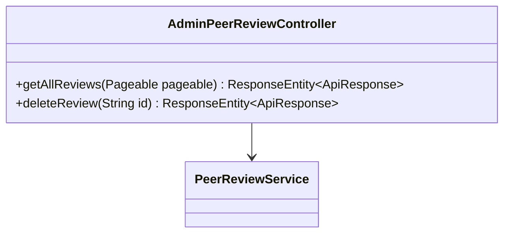
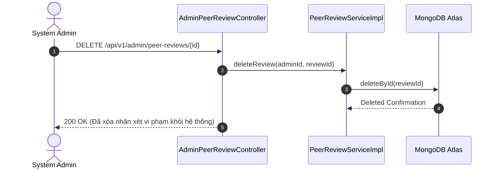

# UC-13.5 — Kiểm Duyệt & Xóa Review Vi Phạm Admin (Admin Peer Review Control)

##  1. Bảng Mô Tả Nghiệp Vụ (Business Description Table)

| Mục | Chi Tiết Nghiệp Vụ |
|---|---|
| **Mã Use Case** | `UC-13.5` |
| **Tên Tính Năng** | Xóa các đánh giá/nhận xét toxic hoặc vi phạm quy chuẩn cộng đồng |
| **Actor Chính** | Admin |
| **Mục Tiêu** | Loại bỏ hoàn toàn bản ghi hoặc feedback vi phạm khỏi hệ thống |
| **API Endpoint** | `DELETE /api/v1/admin/peer-reviews/{id}` |
| **Tiền Điều Kiện** | Quyền `ROLE_ADMIN` |
| **Hậu Điều Kiện** | Xóa bản ghi trong MongoDB Atlas |
| **Quy Tắc Nghiệp Vụ** | Giữ môi trường trao đổi học thuật lành mạnh cho các MC Talent |
| **Các Mã Lỗi Có Thể Gặp** | `REVIEW_NOT_FOUND` (404), `FORBIDDEN` (403) |

---

##  2. Class Diagram

---

##  3. Sequence Diagram

---

##  4. Testing & Verification Report

- **Test Suite Class:** `com.mchub.controllers.AdminPeerReviewControllerTest`
- **Method Kiểm Thử:** `deleteReview_adminRole_deletesToxicReview()`
- **Assertions:** Bản ghi `PeerReviewRequest` bị xóa thành công khỏi DB.
