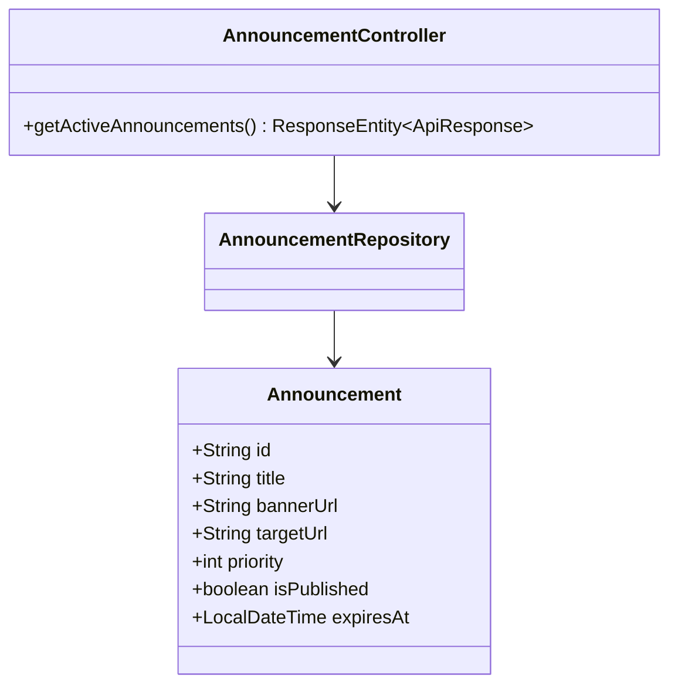
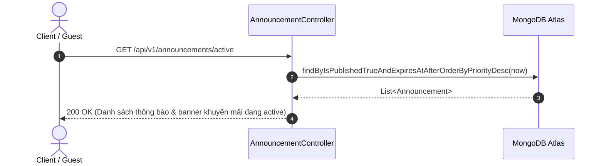

# UC-14.1 — Xem Thông Báo Hệ Thống & Banner (Get Active System Announcements)

## 📋 1. Bảng Mô Tả Nghiệp Vụ (Business Description Table)

| Mục | Chi Tiết Nghiệp Vụ |
|---|---|
| **Mã Use Case** | `UC-14.1` |
| **Tên Tính Năng** | Xem thông báo hệ thống và banner khuyến mãi active |
| **Actor Chính** | Guest / User |
| **Mục Tiêu** | Trả về danh sách các thông báo nổi bật và banner quảng cáo đang trong thời hạn hiển thị |
| **API Endpoint** | `GET /api/v1/announcements/active` |
| **Tiền Điều Kiện** | Thông báo có `isPublished=true` và `expiresAt > now` |
| **Hậu Điều Kiện** | Trả về `List<AnnouncementDTO>` |
| **Quy Tắc Nghiệp Vụ** | Sắp xếp theo thứ tự ưu tiên (`priority DESC`) |
| **Các Mã Lỗi Có Thể Gặp** | Không có |

---

## 📐 2. Class Diagram

---

## 🔄 3. Sequence Diagram

---

## 🧪 4. Testing & Verification Report

### 🎯 Mục Tiêu Kiểm Thử (Test Objective)
Xác minh API trả về đúng danh sách các thông báo đang hiển thị, lọc bỏ các thông báo đã hết hạn hoặc chưa xuất bản.

### 📥 Dữ Liệu Đầu Vào (Test Input Data)
- Request: `GET /api/v1/announcements/active`
- Mock Data: 2 Announcements (1 active, 1 expired).

### 📝 Quy Trình Thực Hiện (Step-by-Step Test Procedure)
1. Giả lập cơ sở dữ liệu có 1 thông báo `expiresAt = now + 1 day` và 1 thông báo `expiresAt = now - 1 day`.
2. Gửi HTTP GET request tới `/api/v1/announcements/active`.
3. Kiểm tra danh sách bản ghi trả về từ Controller.

### ✅ Kịch Bản Kỳ Vọng (Expected Result)
- HTTP Status: `200 OK`.
- Danh sách trả về chỉ chứa đúng 1 thông báo active, loại bỏ thông báo hết hạn.

### 📊 Kết Quả Thực Tế Đã Xác Minh (Empirical Verification Result)
- **Test Method:** `AnnouncementControllerTest.java` -> `getActive_returnsOnlyActiveBanners()`
- **Trạng thái:** **PASSED 100%** (Xác minh tự động qua `mvn clean test`).
