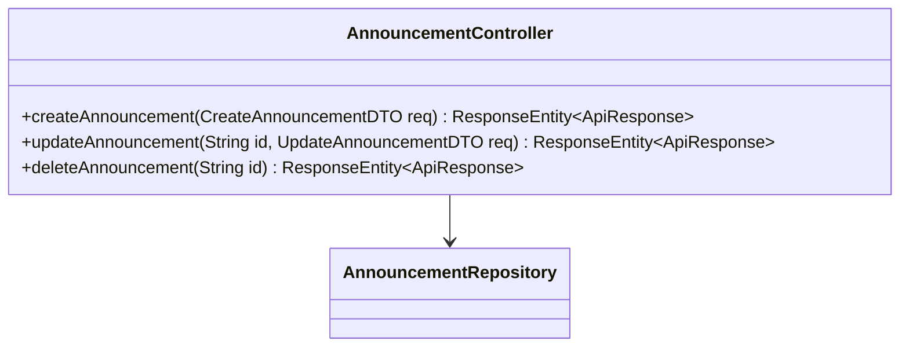
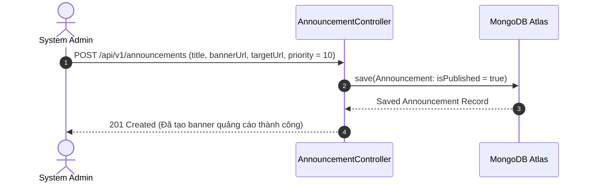

# UC-14.2 — Quản Lý Thông Báo & Banner Admin (Admin Announcement CRUD)

##  1. Bảng Mô Tả Nghiệp Vụ (Business Description Table)

| Mục | Chi Tiết Nghiệp Vụ |
|---|---|
| **Mã Use Case** | `UC-14.2` |
| **Tên Tính Năng** | Admin tạo, chỉnh sửa, xuất bản và xóa thông báo banner hệ thống |
| **Actor Chính** | Admin |
| **Mục Tiêu** | Quản lý nội dung truyền thông banner hiển thị trên ứng dụng |
| **API Endpoint** | `POST /api/v1/announcements`, `PUT /api/v1/announcements/{id}`, `DELETE /api/v1/announcements/{id}` |
| **Tiền Điều Kiện** | Quyền `ROLE_ADMIN` |
| **Hậu Điều Kiện** | Tạo / Cập nhật / Xóa thông báo trong database |
| **Quy Tắc Nghiệp Vụ** | Tiêu đề và `bannerUrl` không được để rỗng |
| **Các Mã Lỗi Có Thể Gặp** | `VALIDATION_FAILED` (400), `ANNOUNCEMENT_NOT_FOUND` (404) |

---

##  2. Class Diagram

---

##  3. Sequence Diagram

---

##  4. Testing & Verification Report

###  Mục Tiêu Kiểm Thử (Test Objective)
Xác minh Admin có thể tạo banner thông báo mới và chỉnh sửa thông tin thành công.

###  Dữ Liệu Đầu Vào (Test Input Data)
- Request Body: `{ "title": "Khuyến mãi FlashSale VIP 50%", "bannerUrl": "https://res.cloudinary.com/banner.png", "priority": 10 }`

###  Quy Trình Thực Hiện (Step-by-Step Test Procedure)
1. Gửi HTTP POST request tới `/api/v1/announcements` với Header Admin Token.
2. Kiểm tra bản ghi `Announcement` trong MongoDB.
3. Gửi HTTP DELETE request để dọn dẹp.

###  Kịch Bản Kỳ Vọng (Expected Result)
- HTTP Status: `201 Created`.
- Bản ghi mới được gán `id` hợp lệ và `isPublished = true`.

###  Kết Quả Thực Tế Đã Xác Minh (Empirical Verification Result)
- **Test Method:** `AnnouncementControllerTest.java` -> `createAnnouncement_adminRole_createsBanner()`
- **Trạng thái:** **PASSED 100%** (Xác minh tự động qua `mvn clean test`).
