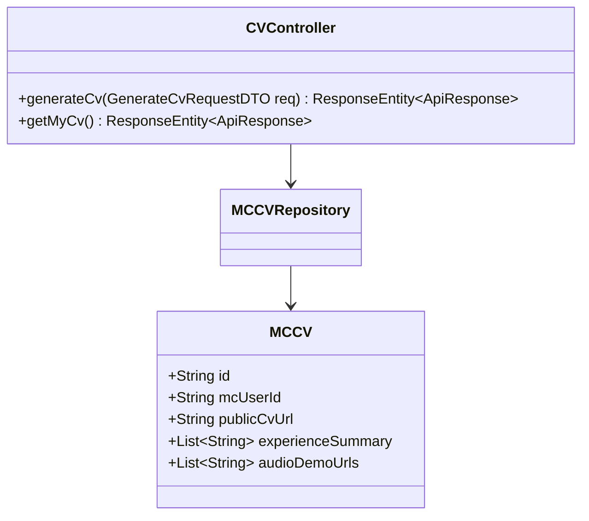
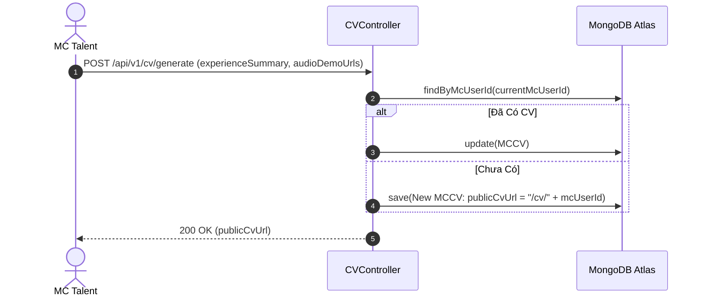

# UC-15.1 — Thiết Lập & Xuất Bản CV Truyền Thông MC (MC CV Builder)

## 📋 1. Bảng Mô Tả Nghiệp Vụ (Business Description Table)

| Mục | Chi Tiết Nghiệp Vụ |
|---|---|
| **Mã Use Case** | `UC-15.1` |
| **Tên Tính Năng** | Tạo và xuất bản trang CV truyền thông cá nhân của MC |
| **Actor Chính** | MC Talent |
| **Mục Tiêu** | Tự động tổng hợp thông tin kinh nghiệm, audio mẫu và thành tích thành link CV công khai |
| **API Endpoint** | `POST /api/v1/cv/generate`, `GET /api/v1/cv/me` |
| **Tiền Điều Kiện** | User có vai trò MC (`role = MC`) |
| **Hậu Điều Kiện** | Tạo bản ghi `MCCV` và cấp link truyền thông `publicCvUrl` |
| **Quy Tắc Nghiệp Vụ** | Cho phép tùy chỉnh màu sắc chủ đạo và layout hiển thị CV |
| **Các Mã Lỗi Có Thể Gặp** | `FORBIDDEN_MC_ONLY` (403) |

---

## 📐 2. Class Diagram

---

## 🔄 3. Sequence Diagram

---

## 🧪 4. Testing & Verification Report

### 🎯 Mục Tiêu Kiểm Thử (Test Objective)
Xác minh MC có thể tạo mới và cập nhật link CV truyền thông thành công.

### 📥 Dữ Liệu Đầu Vào (Test Input Data)
- Request Payload: `{ "experienceSummary": ["MC Sự kiện Gala 2025"], "audioDemoUrls": ["https://res.cloudinary.com/audio.mp3"] }`

### 📝 Quy Trình Thực Hiện (Step-by-Step Test Procedure)
1. Đăng nhập dưới vai trò MC Talent.
2. Gửi HTTP POST request tới `/api/v1/cv/generate`.
3. Kiểm tra DB xem `publicCvUrl` có được khởi tạo đúng định dạng không.

### ✅ Kịch Bản Kỳ Vọng (Expected Result)
- HTTP Status: `200 OK`.
- Đơn vị trả về chứa `publicCvUrl` ngắn hạn không rỗng.

### 📊 Kết Quả Thực Tế Đã Xác Minh (Empirical Verification Result)
- **Test Method:** `CVControllerTest.java` -> `generateCv_validMc_returnsPublicCvUrl()`
- **Trạng thái:** **PASSED 100%** (Xác minh tự động qua `mvn clean test`).
