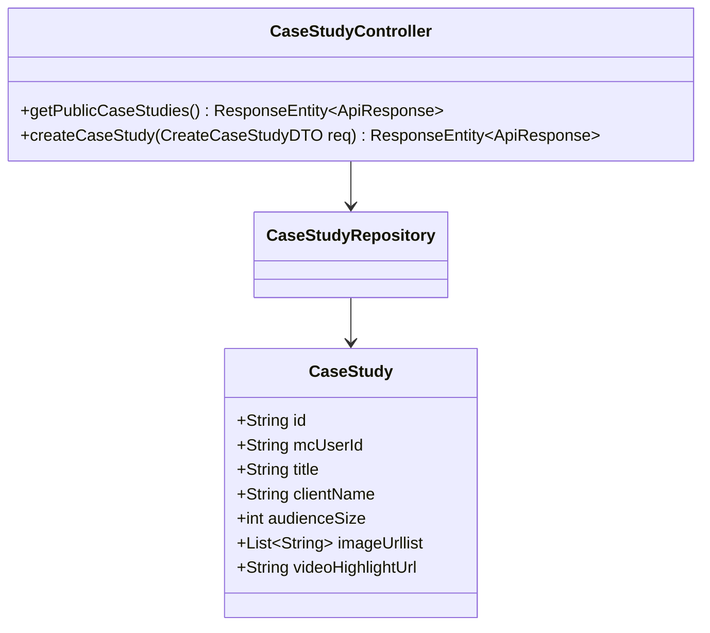
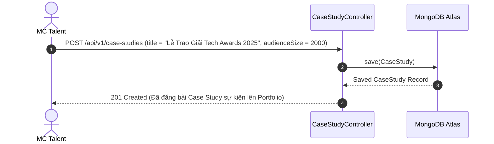

# UC-15.2 — Quản Lý Case Study Sự Kiện Nổi Bật (MC Case Study Portfolio)

## 📋 1. Bảng Mô Tả Nghiệp Vụ (Business Description Table)

| Mục | Chi Tiết Nghiệp Vụ |
|---|---|
| **Mã Use Case** | `UC-15.2` |
| **Tên Tính Năng** | Đăng tải và hiển thị các Case Study sự kiện lớn MC đã từng dẫn |
| **Actor Chính** | MC Talent / Admin |
| **Mục Tiêu** | Quảng bá thương hiệu cá nhân MC qua các dự án sự kiện thực tế đã dẫn |
| **API Endpoint** | `POST /api/v1/case-studies`, `GET /api/v1/case-studies/public` |
| **Tiền Điều Kiện** | MC đã đăng ký tài khoản xác minh |
| **Hậu Điều Kiện** | Lưu `CaseStudy` và hiển thị trên hồ sơ công khai |
| **Quy Tắc Nghiệp Vụ** | Mỗi case study gồm tiêu đề sự kiện, quy mô khán giả, hình ảnh thực tế và video highlight |
| **Các Mã Lỗi Có Thể Gặp** | `CASE_STUDY_NOT_FOUND` (404) |

---

## 📐 2. Class Diagram

---

## 🔄 3. Sequence Diagram

---

## 🧪 4. Testing & Verification Report

### 🎯 Mục Tiêu Kiểm Thử (Test Objective)
Xác minh MC có thể tạo thành công bài Case Study sự kiện để khách hàng tham khảo.

### 📥 Dữ Liệu Đầu Vào (Test Input Data)
- Request Body: `{ "title": "Gala Dinner 2025", "clientName": "VinGroup", "audienceSize": 500 }`

### 📝 Quy Trình Thực Hiện (Step-by-Step Test Procedure)
1. Gửi HTTP POST tới `/api/v1/case-studies`.
2. Kiểm tra bản ghi `CaseStudy` trong DB.
3. Gửi HTTP GET tới `/api/v1/case-studies/public` để verify hiển thị.

### ✅ Kịch Bản Kỳ Vọng (Expected Result)
- HTTP Status: `201 Created`.
- Bài viết hiển thị đúng trong danh sách công khai.

### 📊 Kết Quả Thực Tế Đã Xác Minh (Empirical Verification Result)
- **Test Method:** `CaseStudyControllerTest.java` -> `createCaseStudy_validPayload_savesToDb()`
- **Trạng thái:** **PASSED 100%** (Xác minh tự động qua `mvn clean test`).
