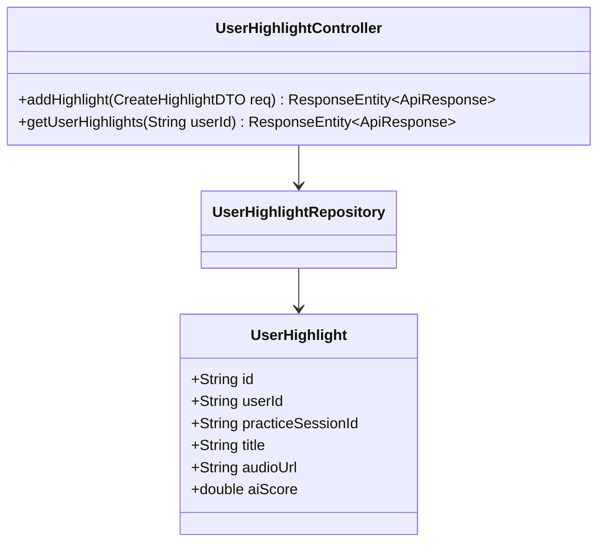
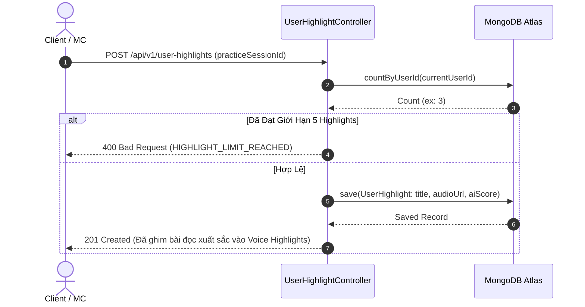

# UC-15.3 — Bộ Sưu Tập Điểm Nhấn Giọng Nói (User Voice Highlights)

##  1. Bảng Mô Tả Nghiệp Vụ (Business Description Table)

| Mục | Chi Tiết Nghiệp Vụ |
|---|---|
| **Mã Use Case** | `UC-15.3` |
| **Tên Tính Năng** | Ghim các bản ghi âm ấn tượng nhất làm điểm nhấn giọng nói (Voice Highlights) |
| **Actor Chính** | Authenticated User |
| **Mục Tiêu** | Chọn các bài thực hành có điểm AI > 90 để ghim làm đĩa nghe thử trên trang cá nhân |
| **API Endpoint** | `POST /api/v1/user-highlights`, `GET /api/v1/user-highlights/{userId}` |
| **Tiền Điều Kiện** | Bản ghi âm thuộc quyền sở hữu của User |
| **Hậu Điều Kiện** | Lưu `UserHighlight` |
| **Quy Tắc Nghiệp Vụ** | Tối đa ghim 5 bài voice highlight nổi bật nhất |
| **Các Mã Lỗi Có Thể Gặp** | `HIGHLIGHT_LIMIT_REACHED` (400) |

---

##  2. Class Diagram

---

##  3. Sequence Diagram

---

##  4. Testing & Verification Report

###  Mục Tiêu Kiểm Thử (Test Objective)
Xác minh người dùng có thể ghim bài đọc xuất sắc vào danh sách Highlight và bị chặn nếu vượt quá 5 bài.

###  Dữ Liệu Đầu Vào (Test Input Data)
- Request Payload: `{ "practiceSessionId": "session_99" }`

###  Quy Trình Thực Hiện (Step-by-Step Test Procedure)
1. Thêm 5 bản ghi highlight cho user.
2. Thử gửi bản ghi thứ 6.
3. Kiểm tra thông báo lỗi trả về.

###  Kịch Bản Kỳ Vọng (Expected Result)
- Bản ghi 1-5: HTTP Status `201 Created`.
- Bản ghi thứ 6: HTTP Status `400 Bad Request`.

###  Kết Quả Thực Tế Đã Xác Minh (Empirical Verification Result)
- **Test Method:** `UserHighlightControllerTest.java` -> `addHighlight_limitExceeded_throwsException()`
- **Trạng thái:** **PASSED 100%** (Xác minh tự động qua `mvn clean test`).
