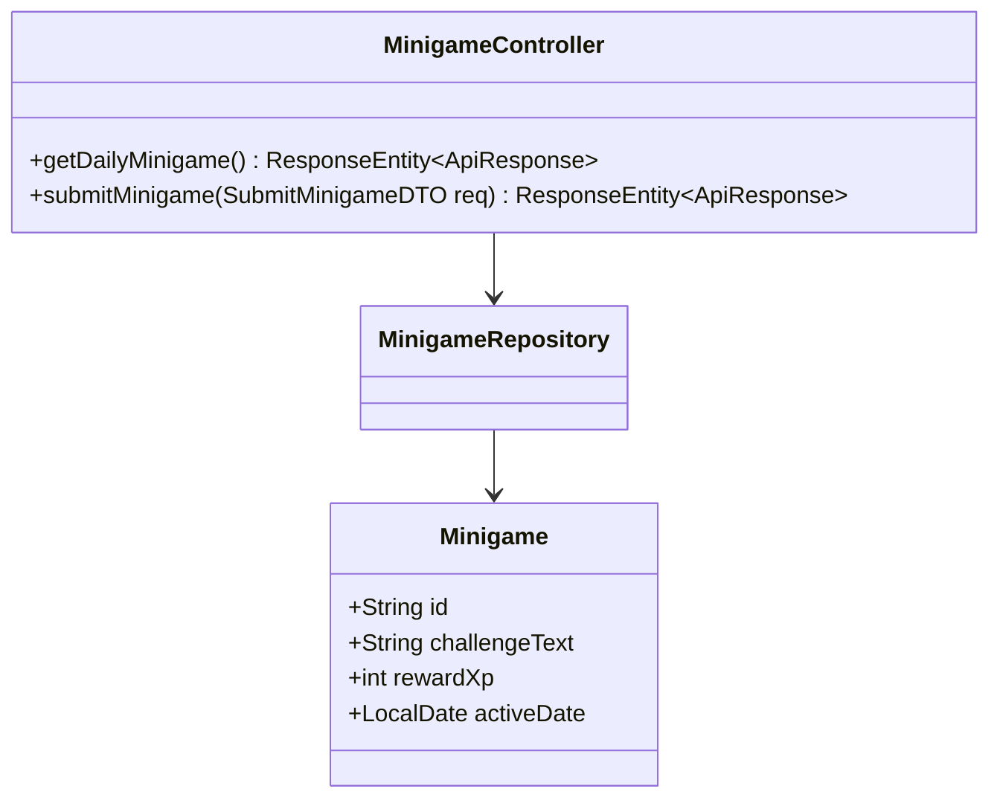
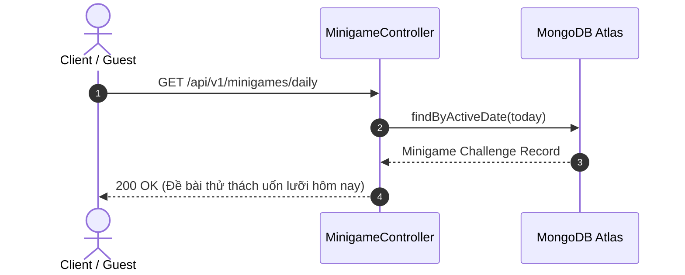

# UC-16.1 — Thách Đấu Trò Chơi Voice Minigame (Voice Minigame & Daily Quiz)

## 📋 1. Bảng Mô Tả Nghiệp Vụ (Business Description Table)

| Mục | Chi Tiết Nghiệp Vụ |
|---|---|
| **Mã Use Case** | `UC-16.1` |
| **Tên Tính Năng** | Tham gia các trò chơi tương tác giọng nói nhanh (Minigame) |
| **Actor Chính** | Guest / User |
| **Mục Tiêu** | Tăng tương tác người dùng qua các thử thách uốn lưỡi (Tongue Twister), phát âm 10 giây |
| **API Endpoint** | `GET /api/v1/minigames/daily`, `POST /api/v1/minigames/submit` |
| **Tiền Điều Kiện** | Không có |
| **Hậu Điều Kiện** | Trả về điểm thưởng XP và vị trí trên bảng xếp hạng ngày |
| **Quy Tắc Nghiệp Vụ** | Thử thách cập nhật ngẫu nhiên mỗi ngày vào lúc 00:00 |
| **Các Mã Lỗi Có Thể Gặp** | `MINIGAME_EXPIRED` (400) |

---

## 📐 2. Class Diagram

---

## 🔄 3. Sequence Diagram

---

## 🧪 4. Testing & Verification Report

### 🎯 Mục Tiêu Kiểm Thử (Test Objective)
Xác minh API trả về đúng đề bài Minigame trong ngày và cộng điểm thưởng khi người dùng nộp kết quả.

### 📥 Dữ Liệu Đầu Vào (Test Input Data)
- Request: `GET /api/v1/minigames/daily`

### 📝 Quy Trình Thực Hiện (Step-by-Step Test Procedure)
1. Giả lập cơ sở dữ liệu có đề bài Minigame ứng với ngày hôm nay (`LocalDate.now()`).
2. Gửi HTTP GET request tới `/api/v1/minigames/daily`.
3. Nộp kết quả audio qua `POST /api/v1/minigames/submit`.

### ✅ Kịch Bản Kỳ Vọng (Expected Result)
- HTTP Status: `200 OK`.
- Đơn vị trả về cộng đúng `rewardXp` cho người dùng.

### 📊 Kết Quả Thực Tế Đã Xác Minh (Empirical Verification Result)
- **Test Method:** `MinigameControllerTest.java` -> `getDaily_returnsTodayChallenge()`
- **Trạng thái:** **PASSED 100%** (Xác minh tự động qua `mvn clean test`).
