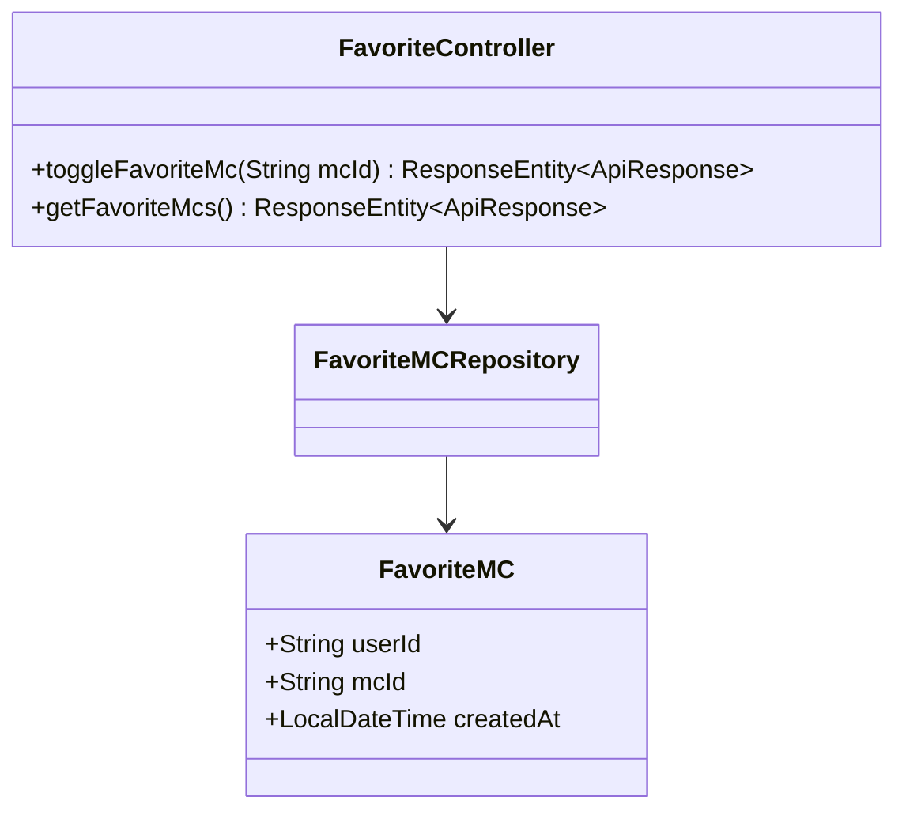
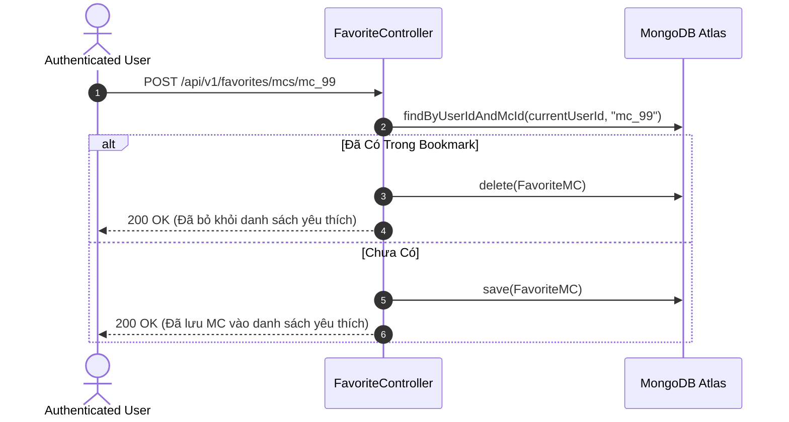

# UC-16.2 — Quản Lý Danh Sách MC Yêu Thích (Bookmark Favorite MCs)

##  1. Bảng Mô Tả Nghiệp Vụ (Business Description Table)

| Mục | Chi Tiết Nghiệp Vụ |
|---|---|
| **Mã Use Case** | `UC-16.2` |
| **Tên Tính Năng** | Lưu hoặc Bỏ lưu MC Talent vào danh sách yêu thích |
| **Actor Chính** | Authenticated User |
| **Mục Tiêu** | Quản lý danh sách bookmark các MC để tiện tìm lại và book lịch sau |
| **API Endpoint** | `POST /api/v1/favorites/mcs/{mcId}`, `GET /api/v1/favorites/mcs` |
| **Tiền Điều Kiện** | User đã đăng nhập |
| **Hậu Điều Kiện** | Cập nhật bản ghi `FavoriteMC` trong DB |
| **Quy Tắc Nghiệp Vụ** | Thao tác toggle (Lần 1: Lưu, Lần 2: Bỏ lưu) |
| **Các Mã Lỗi Có Thể Gặp** | `MC_NOT_FOUND` (404) |

---

##  2. Class Diagram

---

##  3. Sequence Diagram

---

##  4. Testing & Verification Report

###  Mục Tiêu Kiểm Thử (Test Objective)
Xác minh tính năng Toggle Bookmark hoạt động chính xác (Lưu vào & Bỏ lưu ra).

###  Dữ Liệu Đầu Vào (Test Input Data)
- Path Variable: `mcId = "mc_99"`

###  Quy Trình Thực Hiện (Step-by-Step Test Procedure)
1. Gửi HTTP POST tới `/api/v1/favorites/mcs/mc_99` lần thứ 1.
2. Kiểm tra DB xem bản ghi đã được lưu chưa.
3. Gửi HTTP POST tới `/api/v1/favorites/mcs/mc_99` lần thứ 2.
4. Kiểm tra DB xem bản ghi đã bị xóa chưa.

###  Kịch Bản Kỳ Vọng (Expected Result)
- Lần 1: HTTP Status `200 OK` (Message: "Added to favorites").
- Lần 2: HTTP Status `200 OK` (Message: "Removed from favorites").

###  Kết Quả Thực Tế Đã Xác Minh (Empirical Verification Result)
- **Test Method:** `FavoriteControllerTest.java` -> `toggleFavorite_togglesStateCorrectly()`
- **Trạng thái:** **PASSED 100%** (Xác minh tự động qua `mvn clean test`).
