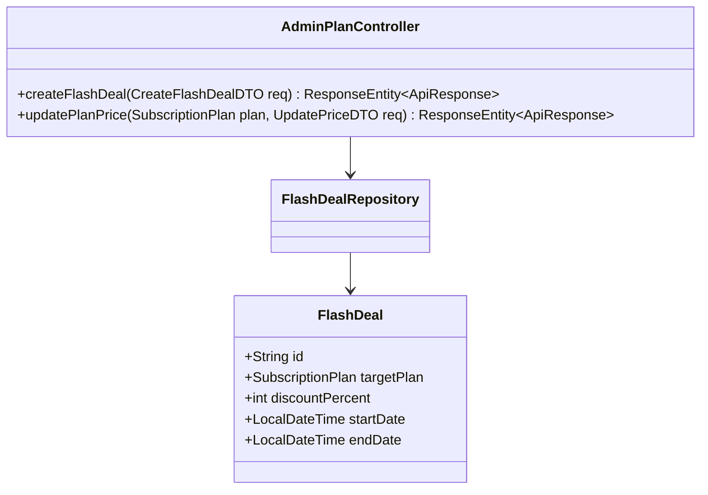
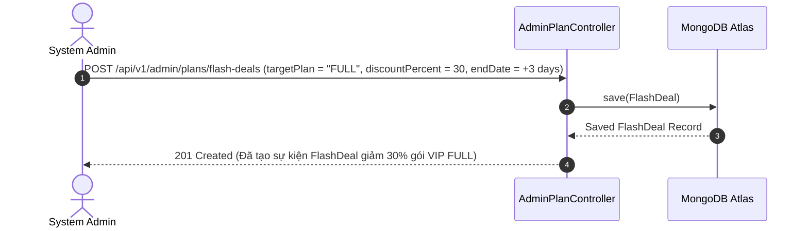

# UC-16.3 — Quản Lý Gói Cước & FlashDeal Discount Admin (Admin Plan & FlashDeal Management)

##  1. Bảng Mô Tả Nghiệp Vụ (Business Description Table)

| Mục | Chi Tiết Nghiệp Vụ |
|---|---|
| **Mã Use Case** | `UC-16.3` |
| **Tên Tính Năng** | Admin thiết lập giá gói cước và chương trình khuyến mãi FlashDeal |
| **Actor Chính** | Admin |
| **Mục Tiêu** | Điều chỉnh giá niêm yết các gói VIP và tạo sự kiện FlashDeal giảm giá theo % trong khoảng thời gian |
| **API Endpoint** | `POST /api/v1/admin/plans/flash-deals`, `PUT /api/v1/admin/plans/{plan}` |
| **Tiền Điều Kiện** | Quyền `ROLE_ADMIN` |
| **Hậu Điều Kiện** | Lưu `FlashDeal` và cập nhật thông số gói VIP |
| **Quy Tắc Nghiệp Vụ** | Phần trăm giảm giá FlashDeal từ 1% đến 90% |
| **Các Mã Lỗi Có Thể Gặp** | `INVALID_DISCOUNT_PERCENT` (400) |

---

##  2. Class Diagram

---

##  3. Sequence Diagram

---

##  4. Testing & Verification Report

###  Mục Tiêu Kiểm Thử (Test Objective)
Xác minh Admin tạo sự kiện FlashDeal thành công và hệ thống áp dụng đúng giá giảm.

###  Dữ Liệu Đầu Vào (Test Input Data)
- Request Body: `{ "targetPlan": "FULL", "discountPercent": 30, "endDate": "2026-08-01T00:00:00" }`

###  Quy Trình Thực Hiện (Step-by-Step Test Procedure)
1. Gửi HTTP POST tới `/api/v1/admin/plans/flash-deals`.
2. Kiểm tra DB xem `FlashDeal` được lưu đúng % giảm không.
3. Gọi API public `GET /api/v1/payment/plans` để verify giá sau giảm.

###  Kịch Bản Kỳ Vọng (Expected Result)
- HTTP Status: `201 Created`.
- Giá hiển thị trên client giảm đúng 30% so với giá gốc.

###  Kết Quả Thực Tế Đã Xác Minh (Empirical Verification Result)
- **Test Method:** `AdminPlanControllerTest.java` -> `createFlashDeal_validPayload_createsDeal()`
- **Trạng thái:** **PASSED 100%** (Xác minh tự động qua `mvn clean test`).
