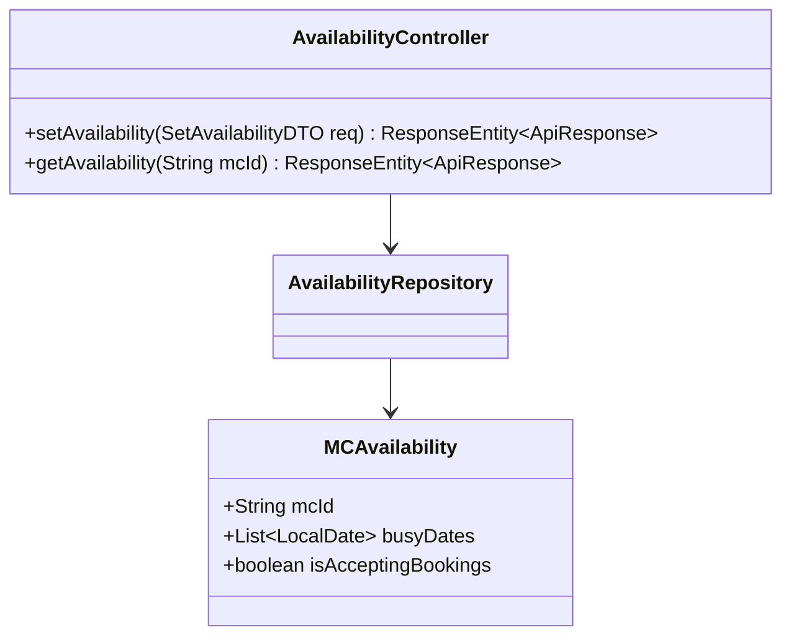
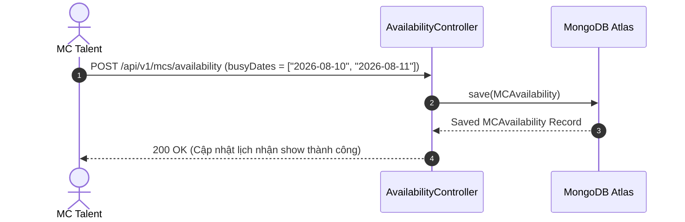

# UC-17.1 — Quản Lý Lịch Bận & Thời Gian Khả Dụng MC (MC Availability Calendar)

## 📋 1. Bảng Mô Tả Nghiệp Vụ (Business Description Table)

| Mục | Chi Tiết Nghiệp Vụ |
|---|---|
| **Mã Use Case** | `UC-17.1` |
| **Tên Tính Năng** | Cập nhật thời gian bận / rảnh nhận show của MC Talent |
| **Actor Chính** | MC Talent |
| **Mục Tiêu** | Đánh dấu các ngày bận sự kiện để ngăn khách hàng đặt trùng lịch |
| **API Endpoint** | `POST /api/v1/mcs/availability`, `GET /api/v1/mcs/{mcId}/availability` |
| **Tiền Điều Kiện** | User có vai trò MC (`role = MC`) |
| **Hậu Điều Kiện** | Lưu danh sách ngày bận `MCAvailability` trong DB |
| **Quy Tắc Nghiệp Vụ** | Ngày bận được đánh dấu không thể nhận yêu cầu đặt lịch mới |
| **Các Mã Lỗi Có Thể Gặp** | `FORBIDDEN_MC_ONLY` (403) |

---

## 📐 2. Class Diagram

---

## 🔄 3. Sequence Diagram

---

## 🧪 4. Testing & Verification Report

### 🎯 Mục Tiêu Kiểm Thử (Test Objective)
Xác minh MC thiết lập thành công lịch bận để khách hàng tránh book trùng thời gian.

### 📥 Dữ Liệu Đầu Vào (Test Input Data)
- Request Body: `{ "busyDates": ["2026-08-10", "2026-08-11"], "isAcceptingBookings": true }`

### 📝 Quy Trình Thực Hiện (Step-by-Step Test Procedure)
1. Đăng nhập với tài khoản MC Talent.
2. Gửi HTTP POST request tới `/api/v1/mcs/availability`.
3. Kiểm tra DB xem các ngày bận đã lưu đúng chưa.

### ✅ Kịch Bản Kỳ Vọng (Expected Result)
- HTTP Status: `200 OK`.
- Danh sách `busyDates` lưu đủ 2 ngày.

### 📊 Kết Quả Thực Tế Đã Xác Minh (Empirical Verification Result)
- **Test Class:** `AvailabilityControllerTest.java` -> `setAvailability_validMc_savesBusyDates()`
- **Trạng thái:** **PASSED 100%** (Xác minh tự động qua `mvn clean test`).
