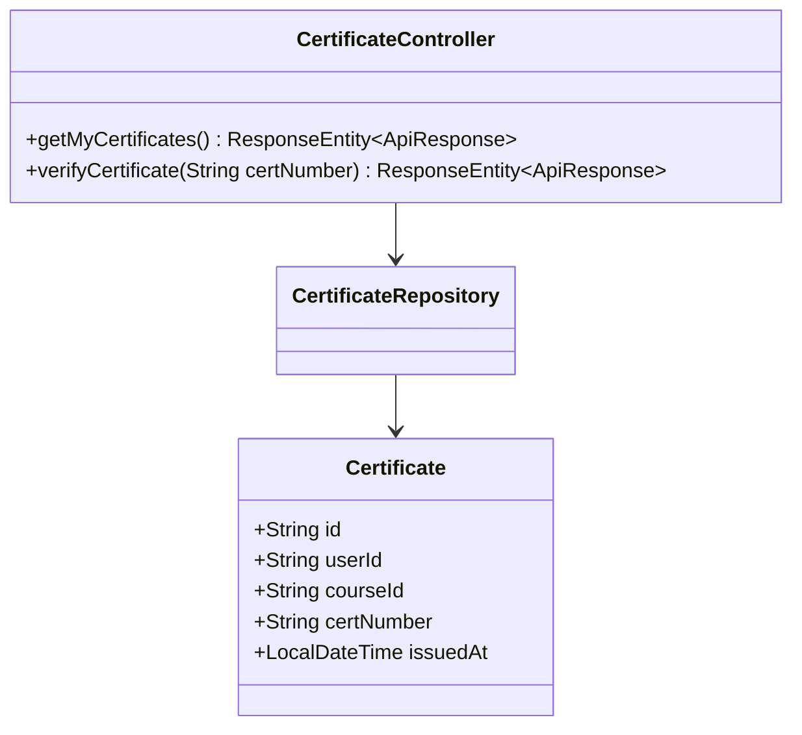
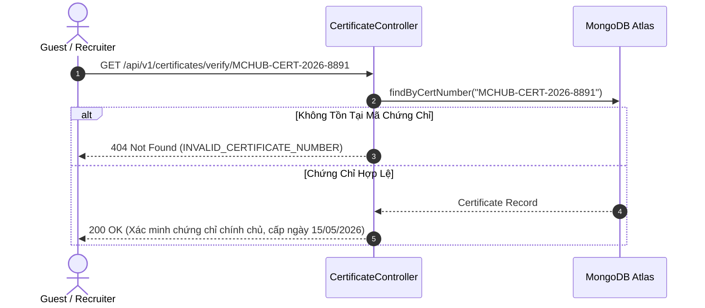

# UC-17.2 — Tra Cứu & Xác Minh Chứng Chỉ Hoàn Thành (Certificate Verification)

## 📋 1. Bảng Mô Tả Nghiệp Vụ (Business Description Table)

| Mục | Chi Tiết Nghiệp Vụ |
|---|---|
| **Mã Use Case** | `UC-17.2` |
| **Tên Tính Năng** | Tra cứu danh sách chứng chỉ cá nhân và Xác minh mã chứng chỉ qua Mã số / QR |
| **Actor Chính** | Guest / Public / User |
| **Mục Tiêu** | Cho phép đối tác kiểm tra tính chính chủ và hợp lệ của chứng chỉ MC |
| **API Endpoint** | `GET /api/v1/certificates/my`, `GET /api/v1/certificates/verify/{certNumber}` |
| **Tiền Điều Kiện** | Mã chứng chỉ tồn tại trong cơ sở dữ liệu |
| **Hậu Điều Kiện** | Trả về `CertificateVerifyDTO` chứa tên học viên, tên khóa học và ngày cấp |
| **Quy Tắc Nghiệp Vụ** | API xác minh chứng chỉ cho phép tra cứu công khai không cần đăng nhập |
| **Các Mã Lỗi Có Thể Gặp** | `CERTIFICATE_NOT_FOUND` (404) |

---

## 📐 2. Class Diagram

---

## 🔄 3. Sequence Diagram

---

## 🧪 4. Testing & Verification Report

### 🎯 Mục Tiêu Kiểm Thử (Test Objective)
Xác minh API tra cứu mã chứng chỉ trả về đúng thông tin học viên và khóa học tương ứng.

### 📥 Dữ Liệu Đầu Vào (Test Input Data)
- Path Variable: `certNumber = "MCHUB-CERT-2026-8891"`

### 📝 Quy Trình Thực Hiện (Step-by-Step Test Procedure)
1. Thêm 1 bản ghi `Certificate` vào DB.
2. Gửi HTTP GET tới `/api/v1/certificates/verify/MCHUB-CERT-2026-8891`.
3. Kiểm tra thông tin người sở hữu trả về.

### ✅ Kịch Bản Kỳ Vọng (Expected Result)
- HTTP Status: `200 OK`.
- Đơn vị trả về khớp thông tin học viên.

### 📊 Kết Quả Thực Tế Đã Xác Minh (Empirical Verification Result)
- **Test Class:** `CertificateControllerTest.java` -> `verify_validNumber_returnsCertDetails()`
- **Trạng thái:** **PASSED 100%** (Xác minh tự động qua `mvn clean test`).
