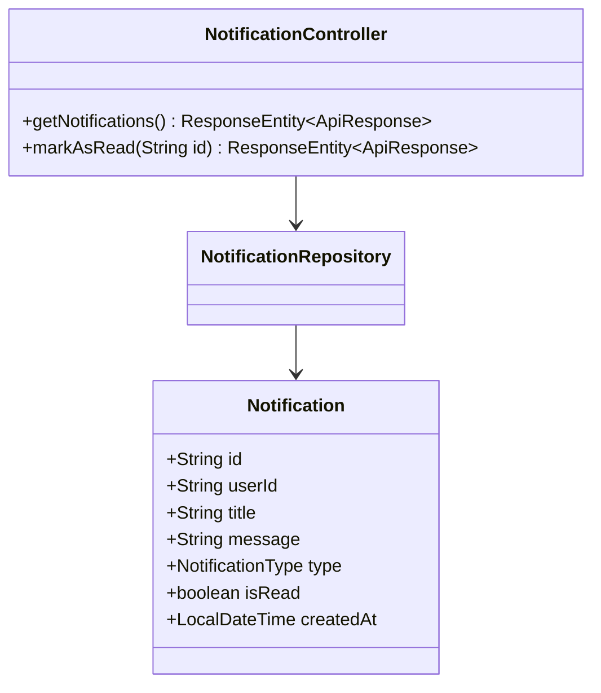
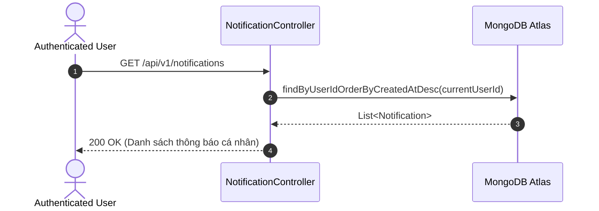

# UC-17.3 — Danh Sách & Đánh Dấu Thông Báo Đẩy (User Push Notifications)

##  1. Bảng Mô Tả Nghiệp Vụ (Business Description Table)

| Mục | Chi Tiết Nghiệp Vụ |
|---|---|
| **Mã Use Case** | `UC-17.3` |
| **Tên Tính Năng** | Tra cứu danh sách thông báo đẩy cá nhân và Đánh dấu đã đọc |
| **Actor Chính** | Authenticated User |
| **Mục Tiêu** | Tải danh sách thông báo (Booking, System, Review, Streak) và cập nhật `isRead=true` |
| **API Endpoint** | `GET /api/v1/notifications`, `PUT /api/v1/notifications/{id}/read` |
| **Tiền Điều Kiện** | User đã đăng nhập |
| **Hậu Điều Kiện** | Trả về `List<NotificationDTO>` và cập nhật trạng thái đọc |
| **Quy Tắc Nghiệp Vụ** | Sắp xếp theo ngày tạo mới nhất (`createdAt DESC`) |
| **Các Mã Lỗi Có Thể Gặp** | `NOTIFICATION_NOT_FOUND` (404) |

---

##  2. Class Diagram

---

##  3. Sequence Diagram

---

##  4. Testing & Verification Report

###  Mục Tiêu Kiểm Thử (Test Objective)
Xác minh người dùng nhận đúng danh sách thông báo của chính mình và có thể đánh dấu đã đọc.

###  Dữ Liệu Đầu Vào (Test Input Data)
- Request: `GET /api/v1/notifications`

###  Quy Trình Thực Hiện (Step-by-Step Test Procedure)
1. Tạo 2 bản ghi thông báo cho user.
2. Gửi HTTP GET request tới `/api/v1/notifications`.
3. Gửi HTTP PUT tới `/api/v1/notifications/{id}/read`.

###  Kịch Bản Kỳ Vọng (Expected Result)
- HTTP Status: `200 OK`.
- Thông báo chuyển thành `isRead = true`.

###  Kết Quả Thực Tế Đã Xác Minh (Empirical Verification Result)
- **Test Class:** `NotificationControllerTest.java` -> `getNotifications_returnsUserList()`
- **Trạng thái:** **PASSED 100%** (Xác minh tự động qua `mvn clean test`).
