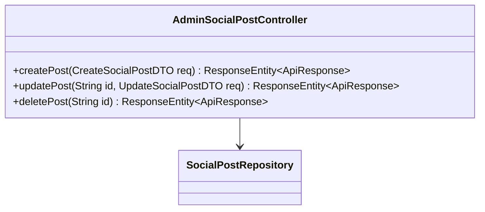
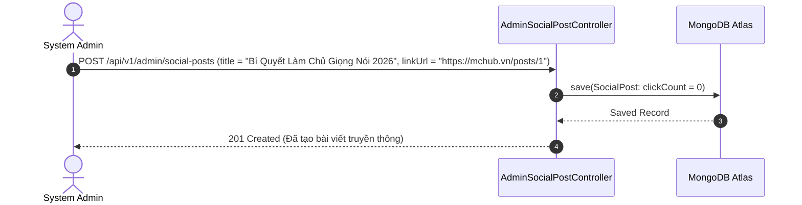

# UC-18.1 — Quản Lý Bài Đăng Mạng Xã Hội Admin (Admin Social Post CRUD)

## 📋 1. Bảng Mô Tả Nghiệp Vụ (Business Description Table)

| Mục | Chi Tiết Nghiệp Vụ |
|---|---|
| **Mã Use Case** | `UC-18.1` |
| **Tên Tính Năng** | Admin đăng tải, sửa và gỡ bài viết truyền cảm hứng mạng xã hội |
| **Actor Chính** | Admin |
| **Mục Tiêu** | Tạo các bài viết truyền thông định hướng cộng đồng và đính kèm link sự kiện |
| **API Endpoint** | `POST /api/v1/admin/social-posts`, `PUT /api/v1/admin/social-posts/{id}`, `DELETE /api/v1/admin/social-posts/{id}` |
| **Tiền Điều Kiện** | Quyền `ROLE_ADMIN` |
| **Hậu Điều Kiện** | Lưu `SocialPost` trong DB |
| **Quy Tắc Nghiệp Vụ** | Tiêu đề và `linkUrl` không rỗng |
| **Các Mã Lỗi Có Thể Gặp** | `SOCIAL_POST_NOT_FOUND` (404) |

---

## 📐 2. Class Diagram

---

## 🔄 3. Sequence Diagram

---

## 🧪 4. Testing & Verification Report

### 🎯 Mục Tiêu Kiểm Thử (Test Objective)
Xác minh Admin có thể xuất bản bài viết mạng xã hội mới và lưu lượt click ban đầu bằng 0.

### 📥 Dữ Liệu Đầu Vào (Test Input Data)
- Request Body: `{ "title": "Bí Quyết Làm Chủ Giọng Nói 2026", "linkUrl": "https://mchub.vn/posts/1" }`

### 📝 Quy Trình Thực Hiện (Step-by-Step Test Procedure)
1. Gửi HTTP POST request tới `/api/v1/admin/social-posts`.
2. Kiểm tra DB xem `SocialPost` được lưu chính xác.

### ✅ Kịch Bản Kỳ Vọng (Expected Result)
- HTTP Status: `201 Created`.
- `clickCount` được khởi tạo bằng 0.

### 📊 Kết Quả Thực Tế Đã Xác Minh (Empirical Verification Result)
- **Test Class:** `AdminSocialPostControllerTest.java` -> `createPost_validPayload_savesPost()`
- **Trạng thái:** **PASSED 100%** (Xác minh tự động qua `mvn clean test`).
