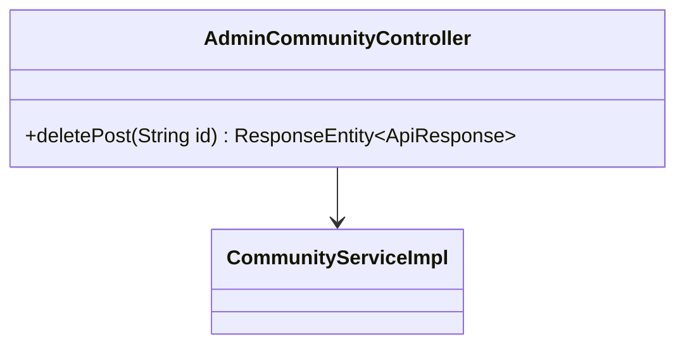
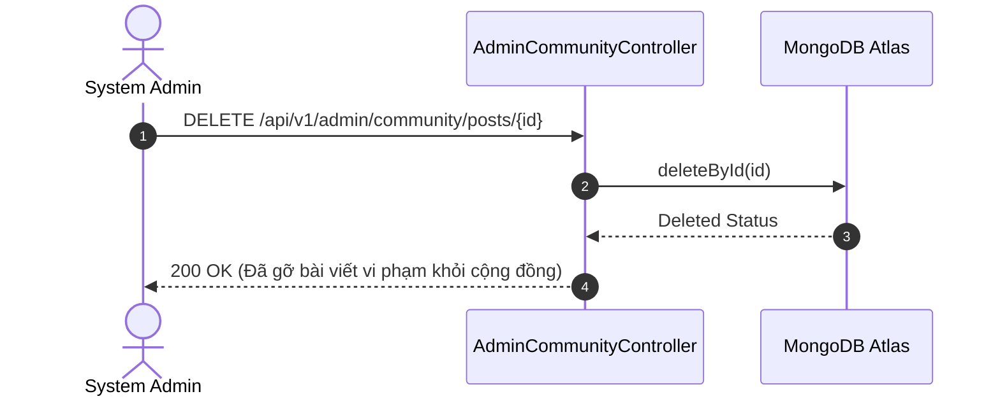

# UC-18.2 — Kiểm Duyệt Bài Viết Cộng Đồng Admin (Admin Community Moderation)

##  1. Bảng Mô Tả Nghiệp Vụ (Business Description Table)

| Mục | Chi Tiết Nghiệp Vụ |
|---|---|
| **Mã Use Case** | `UC-18.2` |
| **Tên Tính Năng** | Admin kiểm duyệt và gỡ bỏ các thảo luận vi phạm tiêu chuẩn cộng đồng |
| **Actor Chính** | Admin |
| **Mục Tiêu** | Giữ môi trường mạng xã hội luyện giọng lành mạnh |
| **API Endpoint** | `DELETE /api/v1/admin/community/posts/{id}` |
| **Tiền Điều Kiện** | Quyền `ROLE_ADMIN` |
| **Hậu Điều Kiện** | Xóa bài viết khỏi cơ sở dữ liệu |
| **Quy Tắc Nghiệp Vụ** | Xóa bài kèm theo ghi vết trong Audit Log |
| **Các Mã Lỗi Có Thể Gặp** | `POST_NOT_FOUND` (404) |

---

##  2. Class Diagram

---

##  3. Sequence Diagram

---

##  4. Testing & Verification Report

###  Mục Tiêu Kiểm Thử (Test Objective)
Xác minh Admin có thể gỡ bỏ bài viết vi phạm tiêu chuẩn cộng đồng.

###  Dữ Liệu Đầu Vào (Test Input Data)
- Path Variable: `id = "post_spam_01"`

###  Quy Trình Thực Hiện (Step-by-Step Test Procedure)
1. Thêm 1 bài viết spam vào DB.
2. Gửi HTTP DELETE request tới `/api/v1/admin/community/posts/post_spam_01`.
3. Kiểm tra DB xem bài viết đã bị xóa chưa.

###  Kịch Bản Kỳ Vọng (Expected Result)
- HTTP Status: `200 OK`.
- Bài viết không còn tồn tại trong DB.

###  Kết Quả Thực Tế Đã Xác Minh (Empirical Verification Result)
- **Test Class:** `AdminCommunityControllerTest.java` -> `deletePost_adminRole_removesPost()`
- **Trạng thái:** **PASSED 100%** (Xác minh tự động qua `mvn clean test`).
