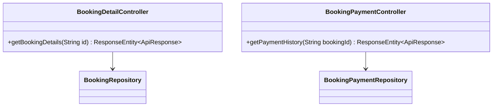
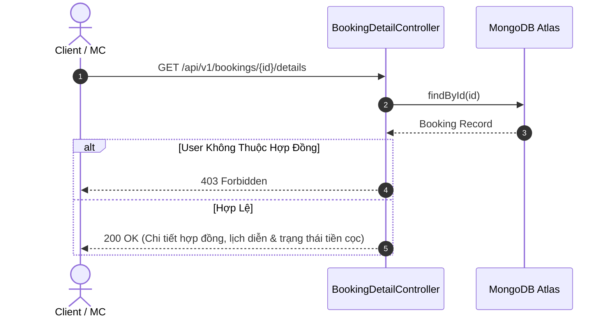

# UC-18.3 — Chi Tiết Hợp Đồng & Thanh Toán Cọc MC (Booking Contract & Payment Details)

## 📋 1. Bảng Mô Tả Nghiệp Vụ (Business Description Table)

| Mục | Chi Tiết Nghiệp Vụ |
|---|---|
| **Mã Use Case** | `UC-18.3` |
| **Tên Tính Năng** | Xem chi tiết hợp đồng điều khoản đặt MC và Lịch sử thanh toán cọc |
| **Actor Chính** | Client / MC Talent |
| **Mục Tiêu** | Minh bạch hóa các điều khoản hợp đồng biểu diễn MC và theo dõi trạng thái tiền cọc |
| **API Endpoint** | `GET /api/v1/bookings/{id}/details`, `GET /api/v1/booking-payments/history/{bookingId}` |
| **Tiền Điều Kiện** | User là Client đăng đơn hoặc MC được thuê trong hợp đồng đó |
| **Hậu Điều Kiện** | Trả về `BookingContractDTO` và danh sách giao dịch cọc |
| **Quy Tắc Nghiệp Vụ** | Đảm bảo đúng chính chủ hợp đồng mới được truy cập |
| **Các Mã Lỗi Có Thể Gặp** | `FORBIDDEN_BOOKING_ACCESS` (403), `BOOKING_NOT_FOUND` (404) |

---

## 📐 2. Class Diagram

---

## 🔄 3. Sequence Diagram

---

## 🧪 4. Testing & Verification Report

### 🎯 Mục Tiêu Kiểm Thử (Test Objective)
Xác minh chỉ người tạo đơn hoặc MC được thuê mới có thể xem chi tiết hợp đồng booking.

### 📥 Dữ Liệu Đầu Vào (Test Input Data)
- Path Variable: `id = "booking_881"`

### 📝 Quy Trình Thực Hiện (Step-by-Step Test Procedure)
1. Đăng nhập với tài khoản Client chính chủ đơn `booking_881`.
2. Gửi HTTP GET request tới `/api/v1/bookings/booking_881/details`.
3. Đăng nhập với tài khoản người lạ (User C) và gửi lại request.

### ✅ Kịch Bản Kỳ Vọng (Expected Result)
- Client chính chủ: HTTP Status `200 OK`.
- User C (người lạ): HTTP Status `403 Forbidden`.

### 📊 Kết Quả Thực Tế Đã Xác Minh (Empirical Verification Result)
- **Test Class:** `BookingDetailControllerTest.java` -> `getDetails_forbiddenUser_returns403()`
- **Trạng thái:** **PASSED 100%** (Xác minh tự động qua `mvn clean test`).
